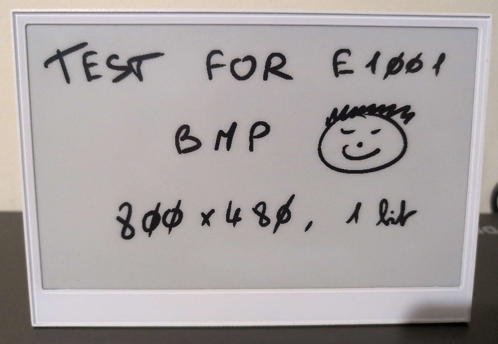
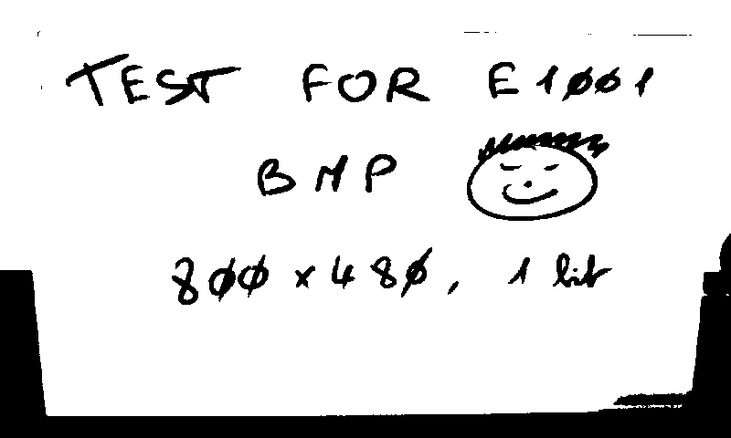

# reTerminal E1001 sd bmp 1bit
Read BMP with 1bit color for reTerminal E1001

## Usage:
- Clone the repository
- copy sd/ok.bpm into an SD card
- insert the SD card on reTerminal E1001
- Use Arduino IDE to open the project: reTerminal-E1001-sd-bmp-1bit.ino
- Configure Board to XIAO_ESP32_S3
- Configure you USB port (example: /dev/ttyUSB0) 
- Upload the project

## How to create a BMP 2bit color Image with gimp
- Open your source image
- resize if needed (E1001 is 800x480)
- Execute the command: Image / Mode / Indexed
  - select Generate optimum palette
  - Maximum  number of colors: 2
- double click on colors and adjuste black & white
- Execute the command: Colors / Map / Rearange Colors
  - Color 0: White
  - Color 1: Black
  - reorder if needed
- Execute the command: File / Export as...
  - give a name with .bmp as extension
  - Don't check the box: Write color space informaiton
  - Confirm that RGB format is 24 bit (R8 G8 B8)

The result should be like that:

